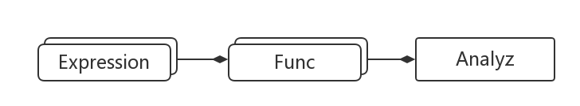

# 编译实习MiniC报告
### 罗昊 1700010686
hcc(Hao miniC Compiler) is a simple compiler for MiniC.\
It contains 3 parts: eeyore, tigger and risc-v. \
Get source code from https://github.com/vangohao/hcc
## supported additional C rules besides MiniC
0. 支持空语句( ; )
1. 支持逻辑表达式与算术表达式互相自动转换.
2. 支持无返回值调用函数.
3. 支持调用函数时使用表达式作为参数.
4. 支持在程序体内声明函数.
5. 支持C风格多行注释和C++风格单行注释.
## error report
0. 报告语法错误和词法错误及其行号,并给出该处正确的token类型提示.
1. 检查标识符使用,如果使用了未定义的标识符会报错.
2. 检查标识符重复,对于重复定义的报错,函数名与变量名冲突的报错,如果在{}程序块内使用与程序块外同名的变量,则不会报错.
3. 检查函数参数表,对于重复声明但参数表不一致,或定义与声明参数表不一致,或调用时所用的参数表与声明的类型不一致时报错.
4. 检查+,-,*,/,%运算符对于数组类型变量的不合法操作给出错误提示,这些操作中除了 (int[])+(int), (int)+(int[]), (int[])-(int), 外涉及数组的运算都是不合法 的.
5. 检查对数组变量的赋值,无法将数值赋给数组变量.
6. 检查a[b]使用,如果a不是数组变量,会报错.
## eeyore
0. 使用flex,bison和C++构建,将输入的MiniC代码转换为Eeyore三地址代码.
1. 使用STL的map模板制作符号表,使用链表串联内外层程序块的符号表.
2. 使用回填法构建eeyore中的标号及goto语句.
## Tigger
### 代码结构
代码由analyz.cpp/h lexer.l tigger.y tigger.cpp/h main.cpp 构成

analyz.cpp: 包含三个类的定义: 
	1.Expression类,每个Expression对象对应一条Tigger/RiscV指令;
	2.Func类,每个Func对象对应一个函数; 
	3.Analyz类,单例类,负责整体处理工作以及函数间优化工作. 

analyz.h: 包含上述三个类的声明.

lexer.l: 词法分析器,负责词法分析,其中对于变量,区分全局变量,局部变量和形参,使用Analyz中的vcount属性为变量分配id,并包含在yylval中.

tigger.y: 语法分析器,负责语法分析,负责将Eeyore语句转换为Expression对象, 以及负责Func类对象创建, Func类对象负责tigger的主要函数体内工作.

tigger.cpp: 包含一些公共函数.

tigger.h: 公共头文件.

main.cpp: 主程序函数和少量全局变量.
### 类结构

1. Expression类:
```c++
class Expression
{
public:
    ExprType type;          //类型
    bool isMove;            //是否为传送指令
    bool dead;              //是否为死代码
    bool visited;           //是否被访问过(用于活性分析)
    vector<int> left;       //左值变量
    vector<int> right;      //右值变量
    vector<int> imm;        //直接数
    vector<int> use;        //使用的变量集合
    vector<int> def;        //定义的变量集合
    set<int> in;            //入口活跃集合
    set<int> out;           //出口活跃集合
    list<Expression*> nexts;//下一条指令集合
    list<Expression*> prevs;//上一条指令集合
    map<int,int> constant;  //常数变量表,用于常数传播
    string funtocall;       //仅用于call语句
     //构造函数,用于创建Expression并自动将指针加入当前所在函数的exprs表
    Expression(ExprType _type,vector<int> _left,
    vector<int> _right,vector<int> _imm,
    string _funtocall="",bool push=true);
};
```
2.Func类
```c++
class Func
{
public:
    Func(int _paramCount,string _name); //构造函数
    void Processor();                   //主函数
    int insert(int s,int v);            //向栈空间添加变量,s为大小,
                                        //v为变量id,返回值为栈上的编号
    void ReturnFunc(int v,int t);       //处理Return语句,v为变量id或常数值,
                                        //t为选项(0表示常数,1表示变量)
    void CallParam(int v,int t);        //处理Param语句,v和t的含义同上
    void CallFunc(int v,string f);      //处理call语句,v为存返回值变量,f为函数名称
    int getParamVar(int r);             //获取形参对应的局部变量编号
    friend class Expression;            //将Expression声明为友元
private:
    int paramCount;                     //参数数量
    int paramToCallWithCount;           //调用参数计数器
    int frameSize;                      //栈空间大小(不含保存调用者保存寄存器的临时空间)
    int frameMaxSize;                   //栈空间大小
    unordered_map<int,int> frameSaveTable;  //记录被调用者保存寄存器的保存位置
    unordered_map<int,int> frameArrayTable; //从栈上数组变量id映射到栈上位置
    string name;                        //函数名称
    vector<int> offset;                 //栈上数据位置
    vector<int> size;                   //栈上数据大小
    vector<int> paramTable;             //形参对应局部变量表
    list<Expression*> exprs;            //语句表
    vector<int> spilledVariableFrameMap; //由变量id映射到上面的offset和size数组的下标


    //Color Algorithm图染色算法
    static int colorNumber;             //颜色数
    list<int> initial;                  //待初始化的节点表
    list<int> simplifyWorklist;         //低度数传送无关节点表
    list<int> freezeWorklist;           //低度数传送相关节点表
    list<int> spillWorklist;            //高度数节点表
    list<int> spilledNodes;             //溢出节点
    list<int> coalescedNodes;           //已合并节点
    list<int> coloredNodes;             //已染色节点
    list<int> selectStack;              //栈
    list<Expression*> coalescedMoves;   //已合并传送指令
    list<Expression*> constrainedMoves; //已约束传送指令
    list<Expression*> frozenMoves;      //已冻结传送指令
    list<Expression*> worklistMoves;    //待合并的传送指令
    list<Expression*> activeMoves;      //活跃的传送指令
    vector<vector<int>> adjMatrix;      //邻接矩阵
    vector<list<int>> adjList;          //邻接表
    vector<int> degrees;                //度
    vector<int> alias;                  //别名
    vector<int> color;                  //颜色
    vector<NodeStatus> status;          //顶点状态
    vector<list<Expression*>> useList;  //使用该变量的指令表
    vector<list<Expression*>> defList;  //定义该变量的指令表
    vector<list<Expression*>> moveList; //与该变量有关的传送指令表


    void ColorAlgorithmMain();          //图染色主函数
    void AddEdge(int x,int y);          //建图添加边
    void livelyAnalyz();                //活性分析
    void InitColorAlgorithm();          //初始化
    void DecrementDegree(int m);        //顶点度数减1
    bool MoveRelated(int n);            //n是否是传送相关的
    list<Expression*>& NodeMoves(int n);//与n相关的传送指令(未冻结的)
    list<int>& Adjacent(int n);         //n的邻点集
    void Simplify();                    //简化
    void Coalesce();                    //合并
    int GetAlias(int x);                //获取别名(由合并产生)
    void AddWorklist(int u);            //加入工作表
    bool TestPrecoloredCombine(int u/*precolored*/,int v); //测试预着色节点相关传送指令是否可以合并
    bool TestConservative(int u,int v); //测试传送指令是否可以保守合并
    void Combine(int u,int v);          //合并
    void EnableMoves(int m);            //将m相关的传送指令设为待合并的
    void FreezeMoves(int u);            //将u相关的传送指令冻结
    void FreezeAction();                //冻结
    void SelectSpill();                 //选择高度数节点溢出
    void AssignColors();                //分配颜色
    void RewriteProgram();              //重写程序,对于有真实溢出的情况
    void InsertExprForWrite(Expression* e,int v);   //插入栈内存写入
    void InsertExprForRead(Expression* e,int v);    //插入栈内存读取
    int GenTempVariable();              //获取一个新临时变量的id

    //程序流处理及优化
    void InitializeVectorSpace();       //初始化
    void InitFunEnv();                  //函数入口形参处理
    int insert();                       //添加一个int变量到栈中
    void frameFree();                   //释放栈的最后一个空间
    void SaveReg();                     //call语句出保存调用者保存的寄存器
    void OptimizeFlow();                //优化程序流(常数传播)
    void OptimizeDead();                //死代码消除
    void OptimizeLoadStore();           //优化
    void genFlow();                     //生成程序流

    //生成代码
    string opstring(int op);            //获得op对应的运算符
    string opinstruct(int op);          //获得op对应的RiscV指令
    void OutputArithRIMul(int reg1,int reg2,unsigned imm);  //处理ArithRI指令的RiscV输出(将乘以2的幂改为左移)
    void GenCode();                     //生成tigger代码
    void GenRiscv64();                  //生成RiscV64代码
    void GenRiscv32();                  //生成Riscv32代码
    void checkReturn();                 //检查函数退出前是否有返回指令
};
```
### 活性分析
以语句为基本块进行自下而上的活性分析
### 寄存器分配
使用图着色算法进行寄存器分配.\
利用活性分析的结果构造冲突图,兼用邻接表和邻接矩阵表示冲突图.\
图染色有四种操作:\
1.简化 对于度数小于k的传送无关的点,将其从图中删除并放入栈中.\
2.合并 对于一条传送指令,对其关联的两个点在保守规则下合并.\
3.冻结 冻结一条传送指令,将他当作非传送指令.\
4.溢出 将图中度数最大的点放入栈中,并从图中删除..\
操作按1.2.3.4的优先级进行,直到图中不再有点.\
将栈中元素依次弹出,并为其分配颜色,如果无颜色可用,则将该顶点真实溢出.\
若有真实溢出发生,则重写程序,为溢出的变量分配栈空间,加入load语句和store语句来读取和写回,并创建临时变量进行运算.
### 其他说明
Tigger不再创建符号表,因为其中所有变量名称的作用域都是全局,所以直接由词法分析器为其分配一个id(>27).\
全局变量和栈数组不分配寄存器,直接存到内存中.
### 预着色节点的处理
Tigger有28个寄存器,给其确定id为0-27,以作为预着色节点,在活性分析中与其他变量处于同等地位. 在图着色时也可与与其相关的传送节点合并.
### 形参的处理
函数参数及返回值需要预着色,函数体的开头会创建临时变量,使用传送指令将预着色节点传送到临时变量作为形参,以避免形参长期占用a开头寄存器.
### 调用函数
该部分tigger.y代码:
```
Expression:
| ...
| PARAM Symbol                                {AnalyzInstance.currentFunc().CallParam($2,1);}
| PARAM INTEGER                                 {AnalyzInstance.currentFunc().CallParam($2,0);}
| Symbol '=' CALL FUNCTION                    {AnalyzInstance.currentFunc().CallFunc($1,$4);}
| ...
```
该部分analyz.cpp代码:
```c++
void Func::CallParam(int v,int t)
{
    if(t == 1)
    {
    new Expression(MoveRR,{(int)(a0)+paramToCallWithCount},{v},{});
    }
    else
    {
    new Expression(MoveRI,{(int)(a0)+paramToCallWithCount},{},{v});
    }
    paramToCallWithCount++;
}
void Func::CallFunc(int v,string f)
{
    vector<int> paramvec;
    paramvec.push_back(int(a0));
    for(int i = 1; i<paramToCallWithCount;i ++)
    {
        paramvec.push_back((int)(a0) + i);
    }
    new Expression(Call,{(int)(a0)},paramvec,{},f);
    new Expression(MoveRR,{v},{(int)(a0)},{});
    paramToCallWithCount = 0;
}
```
Func类设置了一个计数器计数当前传入参数的个数. 计数器初始化为0, 每扫描并处理一个Param语句, 将计数器值加一.\
对于`Param x`语句,将其处理为 `a0 = x`(对应Expression的类型为MoveRR), 其中0可能为0-7,是传参计数器的当前值.\
由Eeyore的构成,在Param语句和对应的Call语句之间不会有其他会改变参数寄存器值的语句,而Call语句的right属性会被设置成{a0,a1,..,at},其中t为参数的个数-1;\
因此活性分析的结果会阻止Param语句和Call语句之间的其他无关变量被分配为a0-at寄存器.

合并预着色点相关传送节点的例子

MiniC代码
```c
int v0;
v0 = getint();
int v1;
v1 = func(v0);
int v2;
v2 = putint(v1+1);
return v2;
```
tigger代码
```x86asm
call getint
call func
a0 = a0 + 1
call putint
return
```

riscv64代码
```x86asm
main:
	add	sp,sp,-16
	sd	ra,8(sp)
	call	getint
	call	func
	addiw	a0,a0,1
	call	putint
	ld	ra,8(sp)
	addi	sp,sp,16
	jr	ra
	.size	main, .-main
```
变量大量合并,只用了a0,没有一条move指令.
